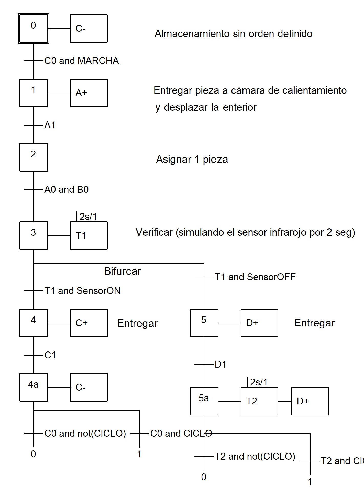
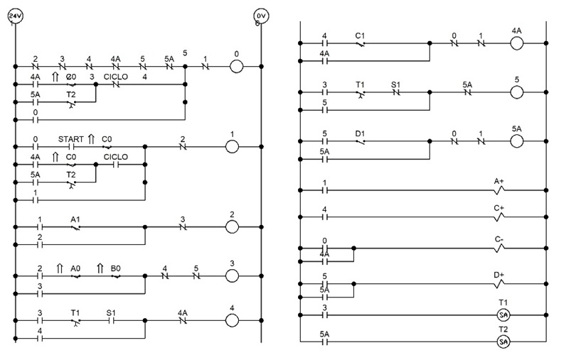

# Industrial Automation & Digital Twin Integration: Hardware-in-the-Loop Simulation
**PLC Control Logic, Pneumatic Systems & OPC Industrial Communication**

## Project Overview
This project involved the end-to-end design and virtual commissioning of three industrial pneumatic systems. The core challenge was to integrate proprietary Siemens PLC logic with third-party simulation software (Festo FluidSIM) to create a high-fidelity "Digital Twin" for testing before physical deployment.

[Demonstration Video of one of the 3 systems](https://youtu.be/gPmN8q1ij7s)

## Tech Stack
* **PLC Programming:** Siemens TIA Portal V15 (Ladder & GRAFCET/SFC).
* **Industrial Simulation:** Festo FluidSIM (Electropneumatics).
* **Communication Protocols:** OPC (Open Platform Communications) via KEPServerEX.
* **Networking Tools:** NettoPLCsim (Network-to-PLCSIM bridge).

---

## Project Case Study

### **Situation**
In industrial automation, testing PLC logic on physical hardware without prior validation can lead to equipment damage and high downtime costs. I was tasked with developing a robust simulation environment for three complex pneumatic modules (Feeding, Sorting, and Extraction) during my Social Service at **BUAP**.

### Hardware-in-the-Loop Layout

### **Task**
My objective was to design the full control logic and establish a seamless, real-time communication bridge between the PLC code and a virtual pneumatic environment, ensuring that the simulated sensors and actuators responded exactly as they would in a real-world factory floor.

### **Action**
To achieve this, I implemented the following technical workflow:
1. **Control Design:** Developed functional specifications using **GRAFCET** to ensure logical consistency and safety interlocks.
2. **Programming:** Translated the GRAFCET diagrams into **Ladder Logic** within **TIA Portal V15**, managing I/O mapping for complex sequences and emergency stops for timeout errors or wrong activation signals.
3. **Systems Integration:** Since Siemens PLCSIM does not natively support external network communication, I implemented **NettoPLCsim** to make the simulated PLC visible to the network.
4. **Data Bridge:** Configured **KEPServerEX (OPC Server)** to map PLC tags and transmit them to **Festo FluidSIM**, creating a closed-loop "Hardware-in-the-Loop" (HiL) simulation.

### **Results**
* **100% Validation:** Successfully validated 3 distinct industrial modules in a risk-free virtual environment.
* **System Efficiency:** Optimized the "Sorting Station" logic, reducing cycle time by ensuring parallel pneumatic movements where safe.
* **Complex Interoperability:** Overcame the limitation of proprietary software silos by establishing a stable OPC communication link, a critical skill in Industry 4.0 environments.
* **Documentation:** Created a comprehensive technical video used by the University to train future mechatronics students.

---

## Technical Documentation
*Note: These images represent the engineering workflow implemented.*

### 1. Control Logic Design (Example: Automated Sorting System)
| Functional Design (GRAFCET) | PLC Implementation (Ladder) |
| :--- | :--- |
|  |  |
| Fluidsim OPC connection with TIA PORTAL V15 |
|  |
*Sequential logic designed for a temperature-based sorting station, including decision branches and safety interlocks.*

This methodology was successfully replicated across three different industrial modules: 
* **Material Feeding System:** Synchronized feeding for machining centers.
* **Welding Station:** Multi-axis pneumatic control for emissions suction.
* **Automated Sorting:** Temperature-based classification using infrared sensing.

## Repository Structure
* `/docs`: Detailed technical reports and schematics.
* `/logic`: TIA Portal project screenshots and tag lists.
* `/simulation`: FluidSIM circuit files (.ct).
* `/media`: Visual evidence and system demonstrations.

---
**Contact Information**
* **Diego Armando Soriano Sánchez** - [LinkedIn](https://www.linkedin.com/in/diego-soriano-eng/)
* **Email:** diegoarmando.sori@gmail.com
